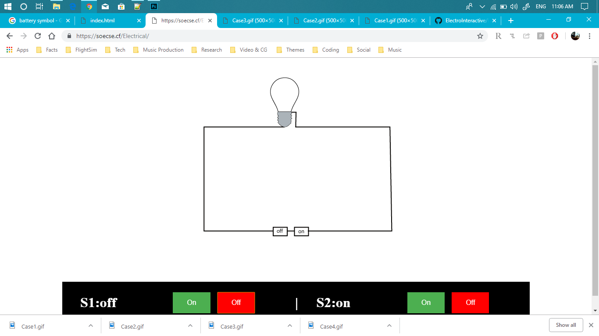

# ElectroInteractive

Electro Interactive is a project which presents a series of Interactive Simulations of Electrical and Electronics Circuits. This project is still in Development and you can contribute to this. You will find basic Circuits in this. This project is coded in JavaScript, HTML and CSS. You can find the Source code in this Repo.

Enjoy!

  <h3> Basic Circuit </h3>
   </img>

